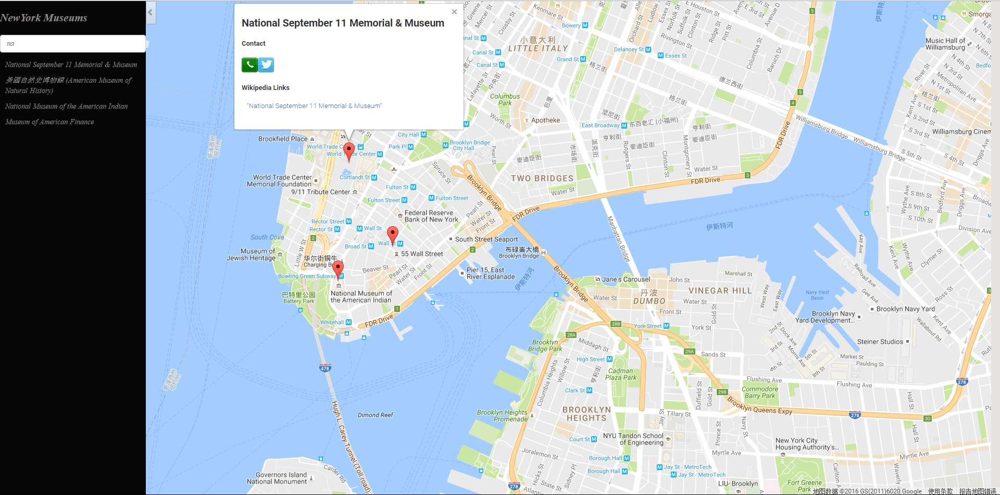

# Neighborhood-Map
A single-page web application, built using the Knockout framework, that displays a Google Map of an area and various points of interest.

## What it can do?
- display locations with markers on google map
- provide a filter input to find what you want
- display location info (name, phone, twitter&facebook&wiki link) when option or marker is clicked
- responsive to mobile phone screen

## Customize
It's set to display NY museums by default, you can customize by change search params for FourSquare API 
in 'js/fourSquare.js':
```javascript
var four_square_request_url = four_square_api_url + '?' + $.param({
        client_id: client_id,
        client_secret: client_secret,
        v: 20130815,
        ll: ' 40.7,-74',
        query: 'museum'
});
```
You can find more about search params in [here](https://developer.foursquare.com/docs/venues/search).

## Screenshot


## Based on:
- [Google Map API](https://developers.google.com/maps/documentation/javascript/)
- [FourSquare API](https://developer.foursquare.com/docs/venues/search)
- [Wikipedia API](https://www.mediawiki.org/wiki/API:Main_page)
- [knockout.js](http://knockoutjs.com/)(A MVVM framework)
- [Bootstap](http://getbootstrap.com/)(customized with only input-group)
- [jQuery](http://jquery.com/)

## To Run:
Open 'index.html'
